# StreamX Visual Documentation

This document provides visual representations of StreamX features using Mermaid diagrams to help you understand how each operation works.

## Table of Contents
- [Scan Operations](#scan-operations)
- [Partitioning Operations](#partitioning-operations)
- [Windowing Operations](#windowing-operations)
- [Zipping Operations](#zipping-operations)
- [Sequence Generation](#sequence-generation)
- [Enhanced Selectors](#enhanced-selectors)
- [Stream Transformations](#stream-transformations)
- [Mathematical Operations](#mathematical-operations)
- [Safe Operations](#safe-operations)
- [Async Processing](#async-processing)

---

## Scan Operations

**Scan operations** provide all intermediate results of a reduction, inspired by Kotlin, Scala, and Haskell.

### How `scan()` Works

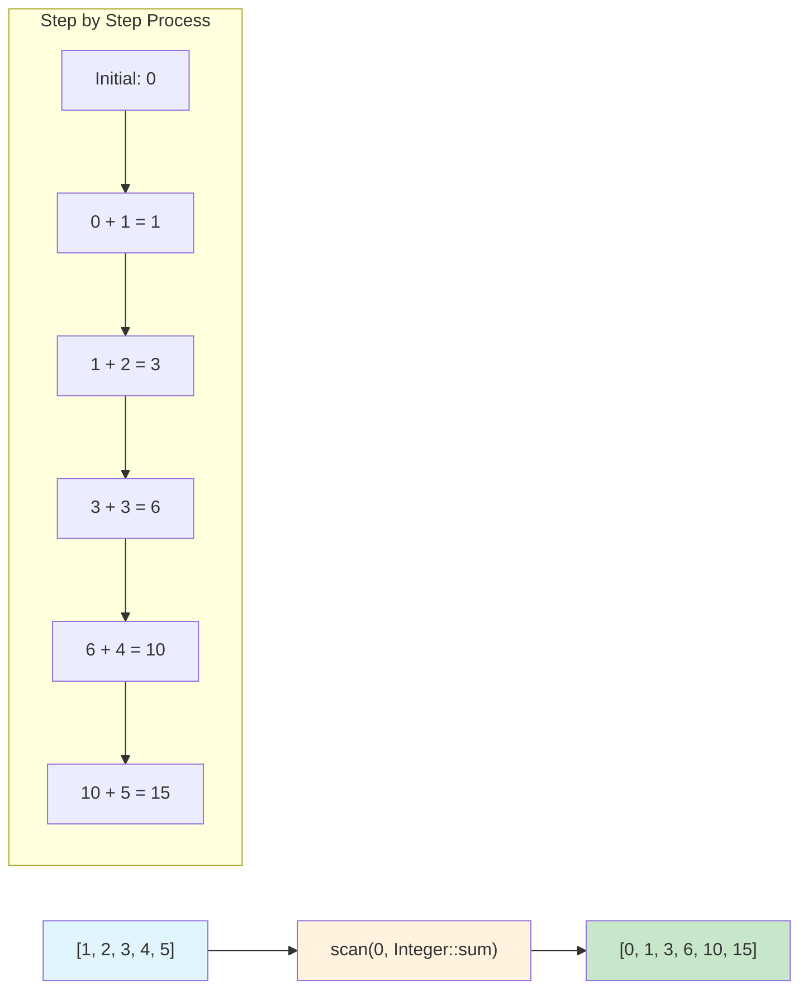

**Key Benefits:**
- See all intermediate results, not just the final one
- Perfect for running totals, cumulative products, etc.
- More efficient than multiple reduce operations

---

## Partitioning Operations

**Partitioning operations** split streams in sophisticated ways beyond simple filtering.

### How `partition()` Works

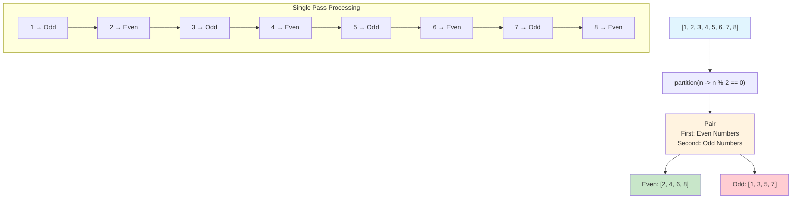

### How `span()` Works

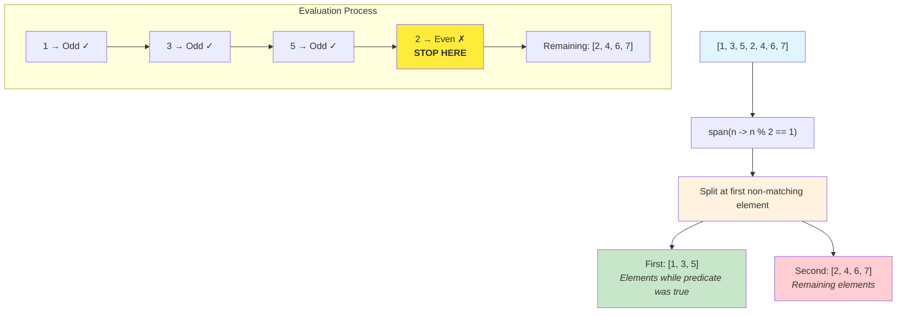

**Key Differences:**
- `partition()` - Separates ALL elements by predicate (like filter + filterNot)
- `span()` - Takes elements UNTIL first non-match, then stops

---

## Windowing Operations

**Windowing operations** process data in sliding windows or fixed-size chunks.

### How `windowed()` Works

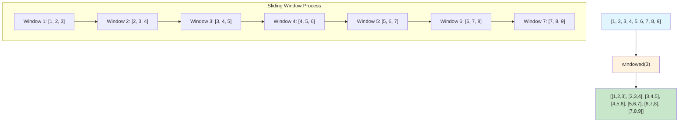

### How `chunked()` Works

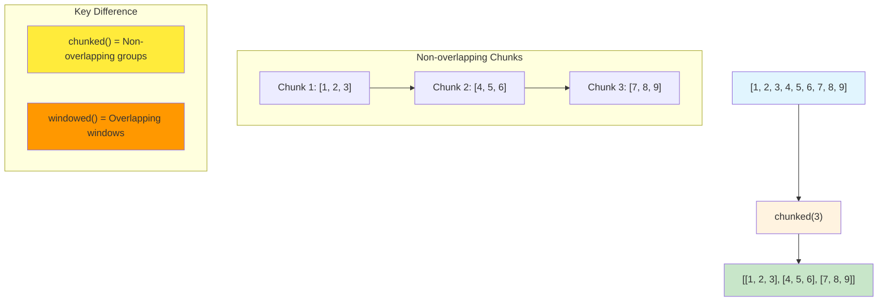

**Use Cases:**
- `windowed()` - Moving averages, trend analysis, pattern detection
- `chunked()` - Batch processing, pagination, data segmentation

---

## Zipping Operations

**Zipping operations** combine multiple streams element-by-element.

### How `zip()` Works

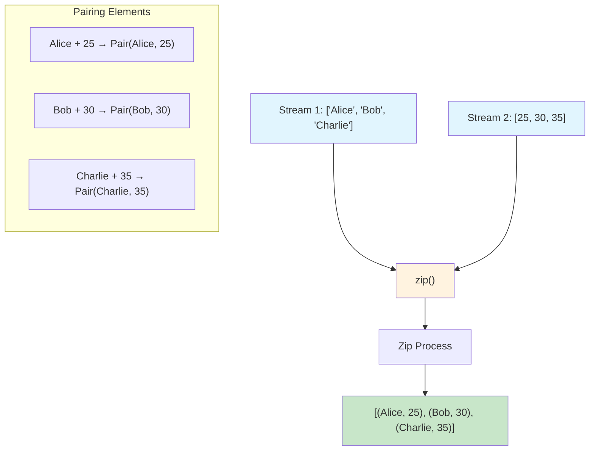

### How `zipAll()` Works with Different Lengths

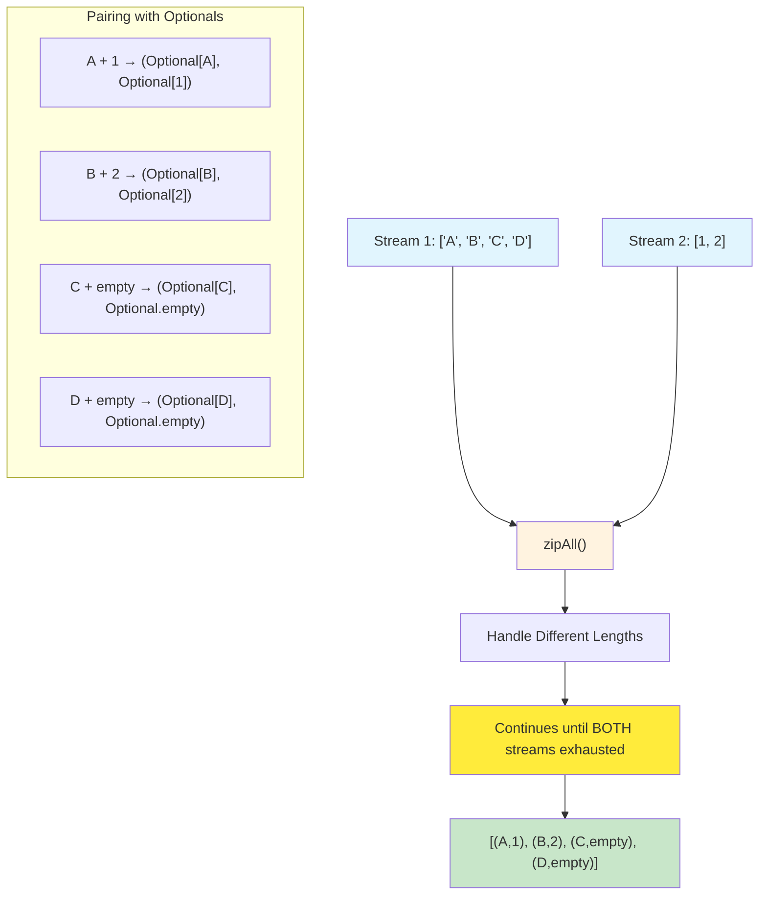

**Key Benefits:**
- `zip()` - Fast pairing for equal-length streams  
- `zipAll()` - Handles different stream lengths gracefully
- `zipLongest()` - Uses default values instead of Optionals

---

## Sequence Generation

**Sequence generation** creates infinite streams and programmatic sequences inspired by Haskell and Clojure.

### How `cycle()` Works

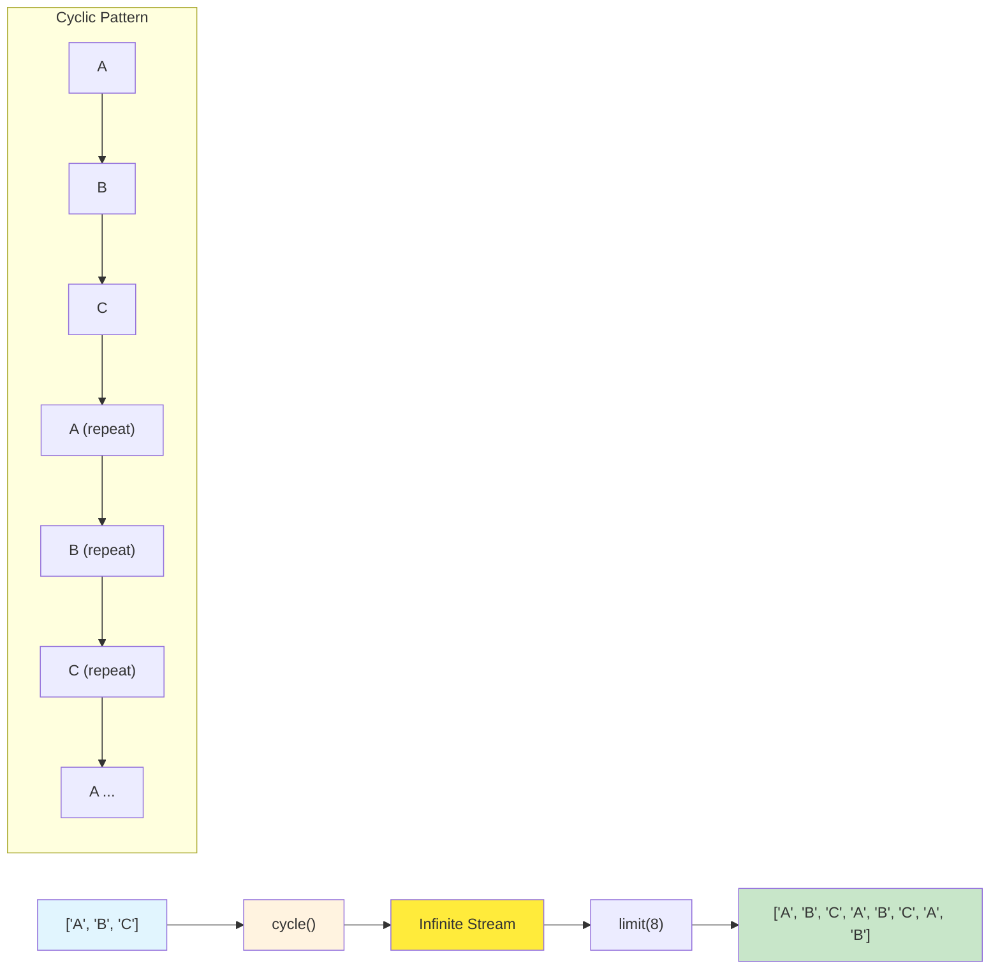

### How `repeat()` vs `replicate()` Work

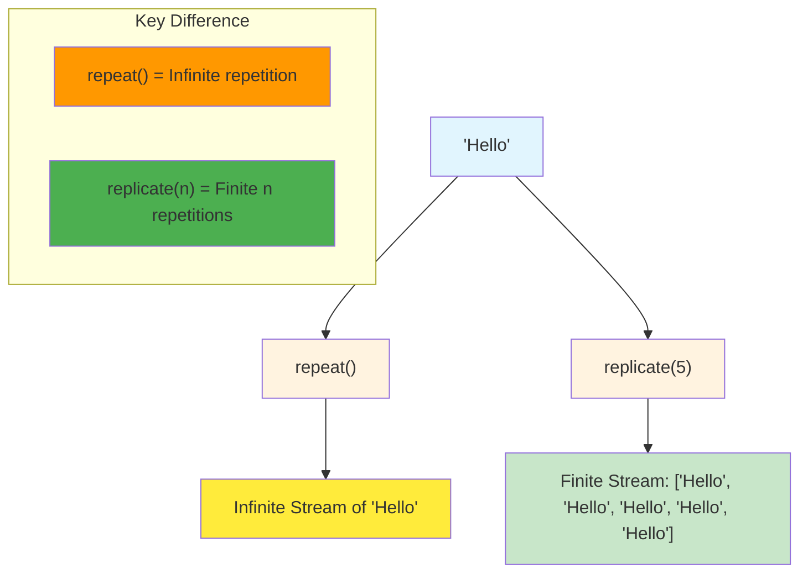

**Use Cases:**
- `cycle()` - Round-robin processing, infinite patterns
- `repeat()` - Default values, infinite padding
- `replicate()` - Fixed-size initialization, test data
- `range()` - Numeric sequences with custom steps

---

## Enhanced Selectors

**Enhanced selectors** find and sort elements by custom criteria, inspired by Kotlin.

### How `minBy()` Works

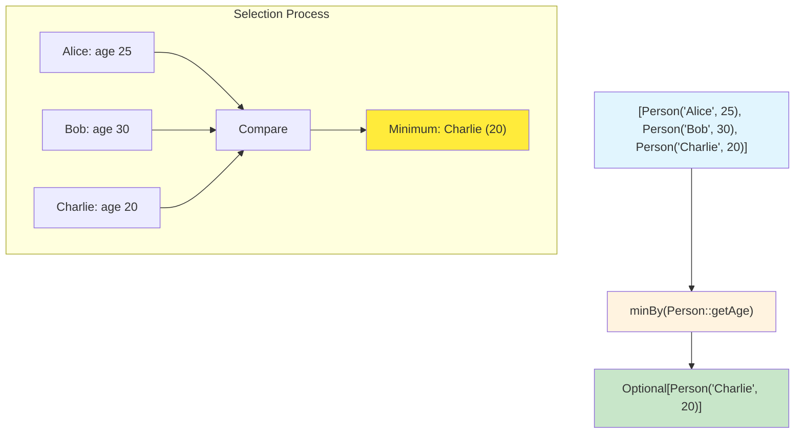

### How `distinctBy()` Works

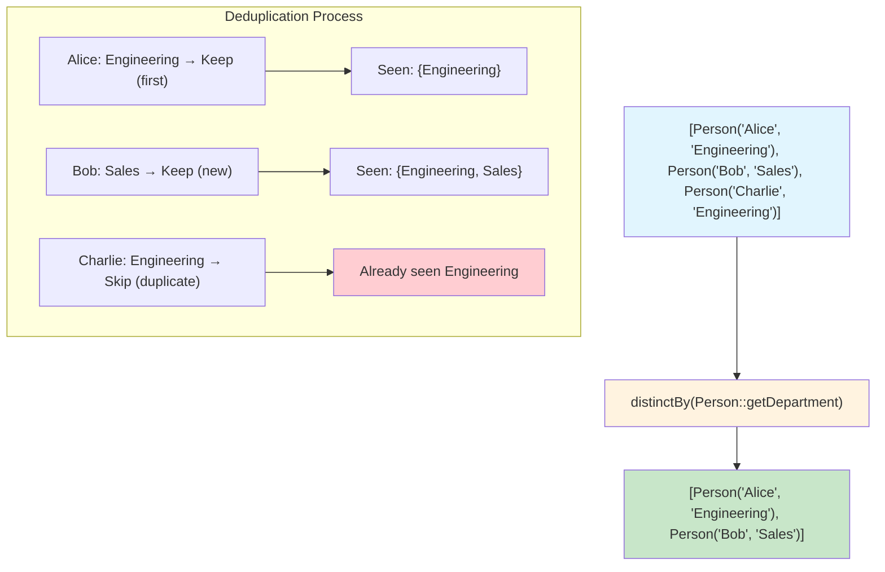

**Key Operations:**
- `minBy()` / `maxBy()` - Find min/max by custom selector
- `sortedBy()` - Sort by custom key  
- `distinctBy()` - Remove duplicates by custom key
- `filterIsInstance()` - Type-safe filtering

---

## Mathematical Operations

**Mathematical operations** provide comprehensive statistics and numerical analysis.

### How `statistics()` Works

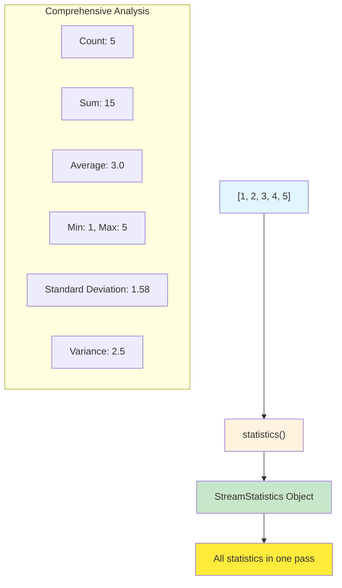

### How `frequencies()` Works

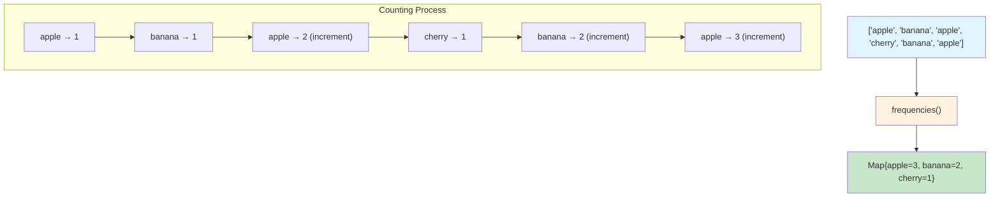

**Available Operations:**
- `statistics()` - Complete statistical analysis in one pass
- `median()` - Middle value calculation
- `mode()` - Most frequent element
- `frequencies()` - Element frequency counting
- `cumSum()` / `cumProduct()` - Cumulative operations

---

## Safe Operations

**Safe operations** handle errors gracefully without breaking the stream flow.

### How `mapSafely()` Works

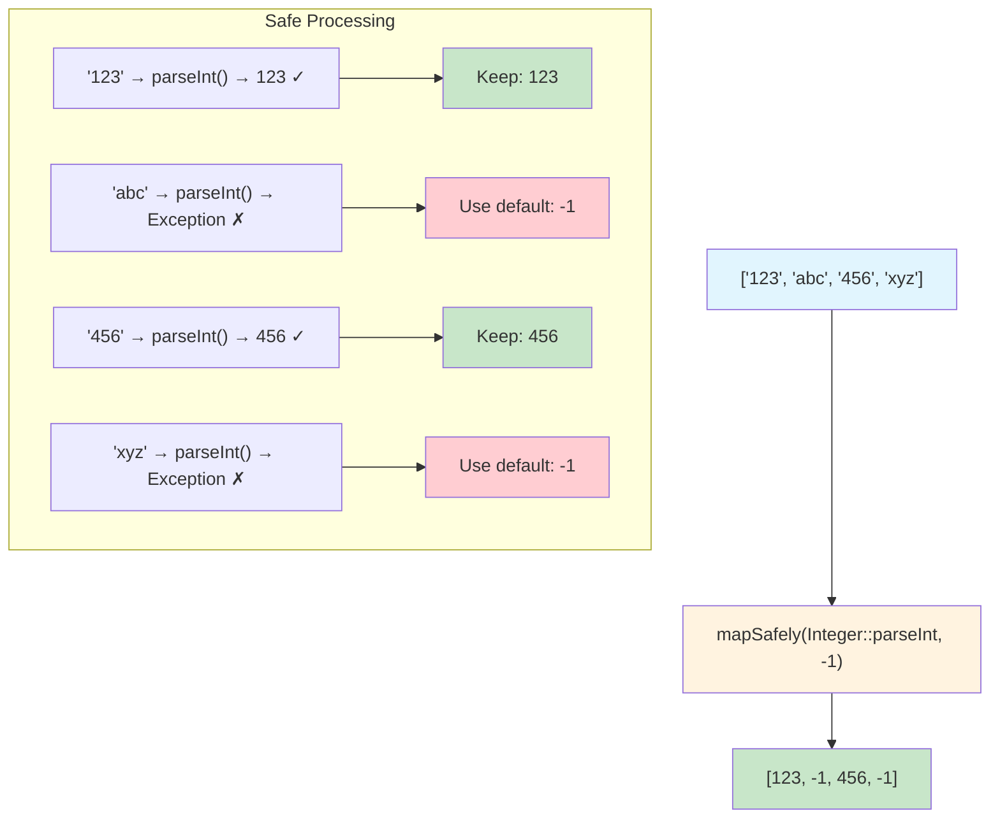

**Benefits:**
- No stream interruption on exceptions
- Configurable default values
- Clean error handling without try-catch blocks

---

## Async Processing

**Async processing** enables parallel execution of stream operations.

### How `asyncMap()` + `awaitAll()` Work

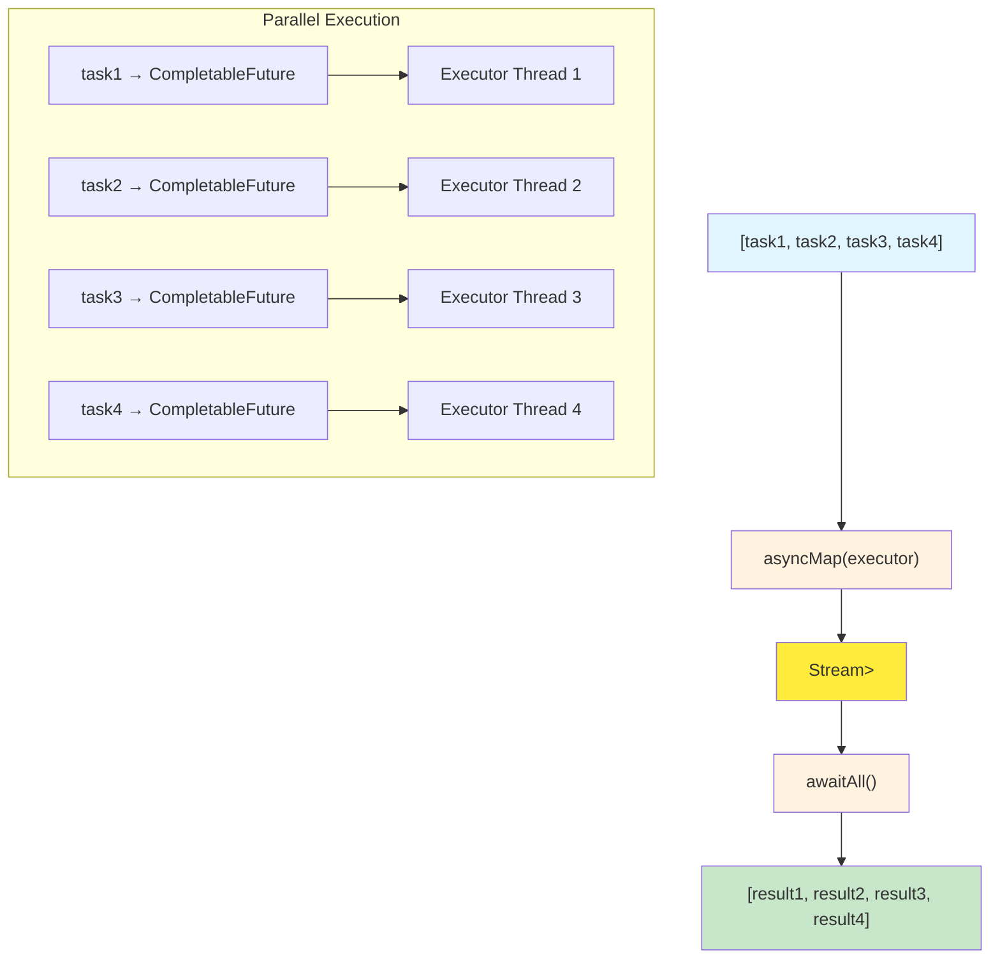

**Key Features:**
- Parallel processing for I/O bound operations
- Custom executor support
- Clean CompletableFuture management

---

## Stream Transformations

StreamX also provides advanced transformation operations inspired by functional programming:

- **`unzip()`** - Split paired streams back into two streams
- **`transpose()`** - Flip 2D stream structure (rows ↔ columns)  
- **`pairwise()`** - Create consecutive element pairs
- **`interpose()`** - Insert separators between elements
- **`let()`** - Apply function to stream and continue pipeline

---

## Summary

This visual documentation demonstrates how StreamX brings functional programming power to Java Streams through:

1. **Clear Visual Models** - Each operation is easy to understand
2. **Efficient Processing** - Single-pass operations where possible  
3. **Error Resilience** - Graceful handling of edge cases
4. **Performance Focus** - Optimized algorithms (e.g., topN uses heaps)
5. **Type Safety** - Full generic support with compile-time checking

StreamX transforms complex stream operations into intuitive, visually understandable processes that make your Java code more expressive and maintainable.

**For complete API documentation and examples, see the [README](README.md) and [CHANGELOG](CHANGELOG.md).**
